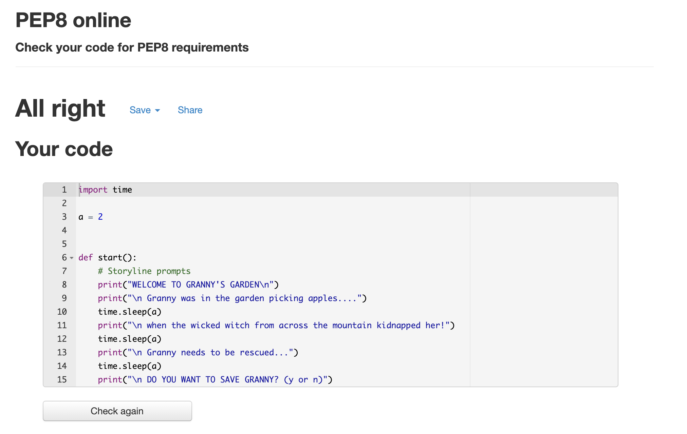

<h1 align="center">Granny's Garden</h1>

[View the live project here.](https://)

Granny's Garden is a Python terminal game which runs in a mock terminal on Heroku. Users have to try and save Granny 
who has been kidnapped by the wicked witch.

### Origin of the game

Granny's Garden is a logic game based on the educational adventure game created for the British BBC Micro computer, released in 1983. You can read more about it on:
 

[Wikipedia](https://en.wikipedia.org/wiki/Granny%27s_Garden)

# How to play

The user is presented with an introduction storyline which presents how Granny has been kidnapped from her garden by the wicked witch.
 

The user is asked to rescue granny. If the user agrees , the games proceeds presenting the user with various options through the game.
 

Eventually the user will complete the game by either losing as the incorrect path was chosen or winning by rescuing granny after the correct path is chosen.
 

At every stage the user is presented with two paths. Should the user type in an incorrect answer , the game will alert the user as "Incorrect Answer". Furthermore , at that stage will check if the user wants to continue playing or quit the game. This has been designed to allow the user to quit the game at any stage without feeling trapped. Should it have just been a mistake the user is taken back to the start of the same function , to continue playing from where they were.
 

# Data Model

The logic of the game has been based on the flow chart created on 

[Lucid Charts](https://www.lucidchart.com/pages/).

<h2 align="center"></h2>
    
   
# Testing

I have manually tested this project by doing the following:

- Passed the code through PEP8 linter and confirmed there are no problems.
- Given invalid options to ensure the function will check if the user wantes to continue playing or quit the game.
- Tested in my local terminal and Heroku terminal.

<h2 align="center"></h2>

### Bugs
Solved Bugs

When I worte the project,notable errors included:

- Unwanted white spaces
- Incorrect indentation , which resulted in the program not working properly.
- Incorrect line spaces between functions.
