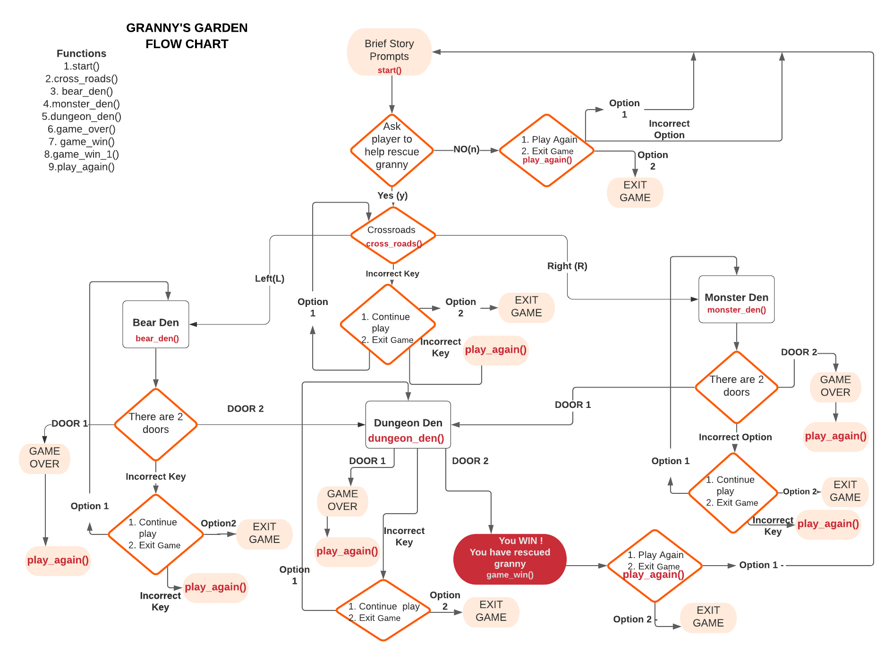

<h1 align="center">Granny's Garden</h1>

[View the live project here.](https://grannys-garden.herokuapp.com/)
<h2 align="center"></h2>

Granny's Garden is a Python terminal game which runs in a mock terminal on Heroku. Users have to try and save Granny 
who has been kidnapped by the wicked witch.

### Origin of the game

Granny's Garden is a logic game based on the educational adventure game created for the British BBC Micro computer, released in 1983. You can read more about it on [Wikipedia](https://en.wikipedia.org/wiki/Granny%27s_Garden). 

# How to play

The user is presented with an introduction storyline which presents how Granny has been kidnapped from her garden by the wicked witch.
 

The user is asked to rescue granny. If the user agrees , the games proceeds presenting the user with various options through the game.
 

Eventually the user will complete the game by either losing as the incorrect path was chosen or winning by rescuing granny after the correct path is chosen.
 

At every stage the user is presented with two paths. Should the user type in an incorrect answer , the game will alert the user as "Incorrect Answer". Furthermore , at that stage will check if the user wants to continue playing or quit the game. 
This has been done to allow the user to exit the game at any stage without feeling trapped. 

If the user continues to type an incorrect answer it will take them
to the play_again() function to check if they still want to play.

 

# Data Model
The logic of the game has been based on the flow chart created on 
[Lucid Charts](https://www.lucidchart.com/pages/).

<h2 align="center"></h2>
    
   
# Testing

I have manually tested this project by doing the following:

- Passed the code through PEP8 linter and confirmed there are no problems.
- Given invalid options to ensure the function will check if the user wantes to continue playing or quit the game.
- Tested in my local terminal and Heroku terminal.

# Bugs
### Solved Bugs

When I wrote the project,notable errors included:

- Unwanted white spaces.
- Incorrect indentation , which resulted in the program not working properly.
- Incorrect line spaces between functions.
- Within each function , the nested "if" statement within the "else" statement was not working properly as it had not been structured properly.

### Remaining Bugs
- No bugs remaining.

### Validator Testing
 - PEP8 

    - No errors were returned from PEP8online.com.

    <h2 align="center"></h2>

# Creation and Deployment

The project has been created on gitpod and deployed to GitHub Pages. 

It was then deployed using a mock terminal for Heroku.

- Steps for deployment to Heroku Mock Terminal
    - Fork or clone this repository.
    - Create a new Heroku app.
    - Set the buildbacks to Python and NodeJS , in that order.
    - Link the Heroku app to the repository.
    - Click on deploy.

# Credits
### Code & Creation

-   [The Coding pie](https://thecodingpie.com/post/make-your-own-text-based-adventure-game-in-python3) 

-   [Lucid Charts](https://www.lucidchart.com/pages/) 

### Inspiration

-  [Granny's Garden](https://en.wikipedia.org/wiki/Granny%27s_Garden)

### Content

-   All content was written by the developer.

### Media

- Mock Terminal Screen Shot was sourced from [AmIresponsive](ami.responsivedesign).

### Acknowledgement(s)

-  I would like thank my mentor Adegbenga Adeye. His guidance in giving constructive feedback through all stages of site design and development has been most valuable.