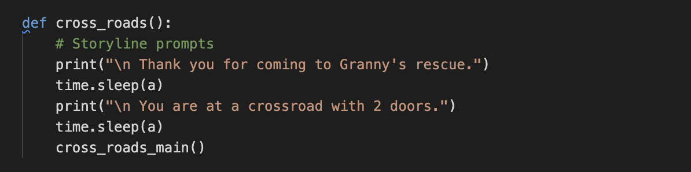
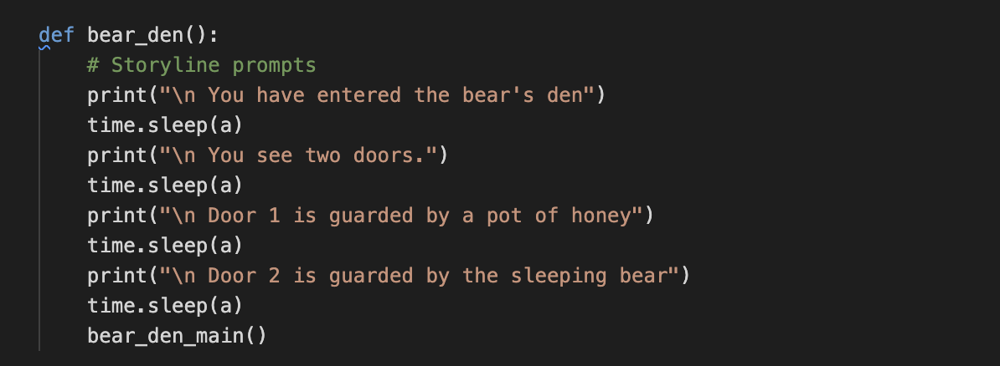
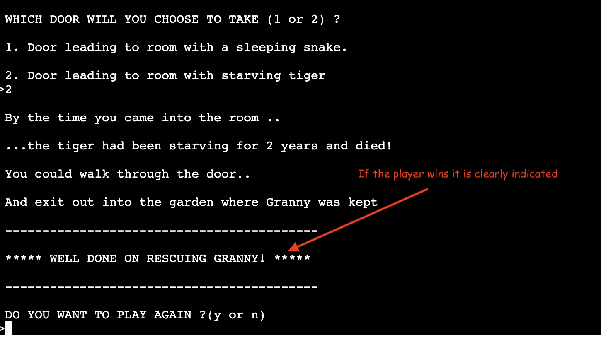
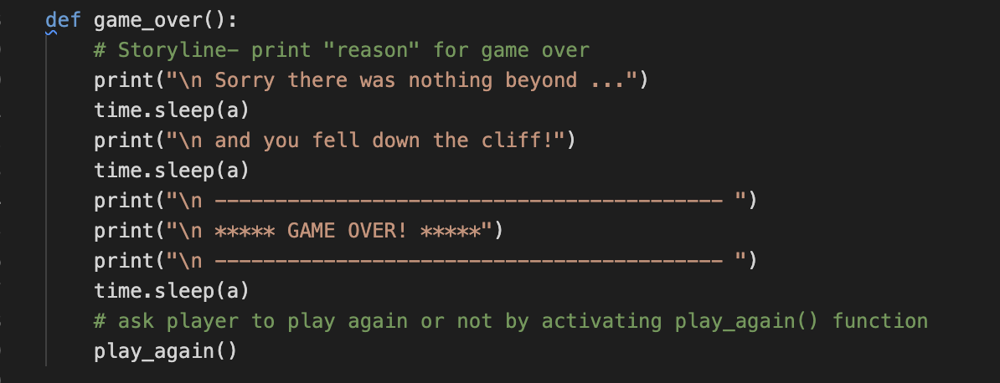
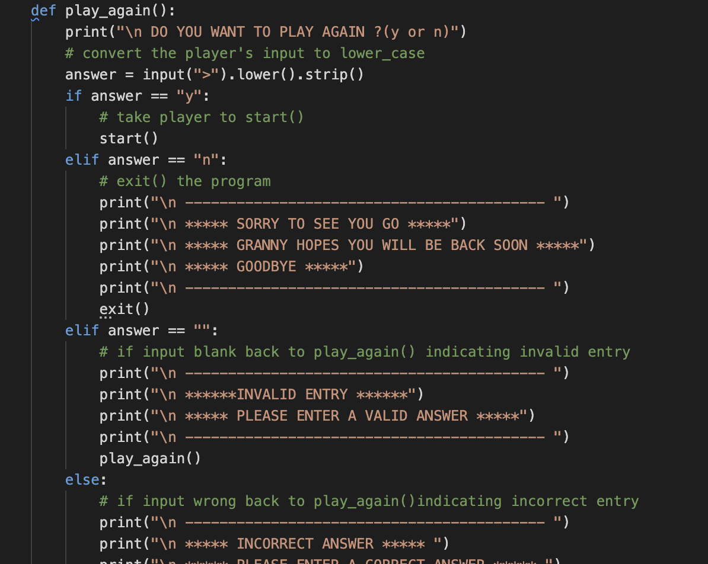
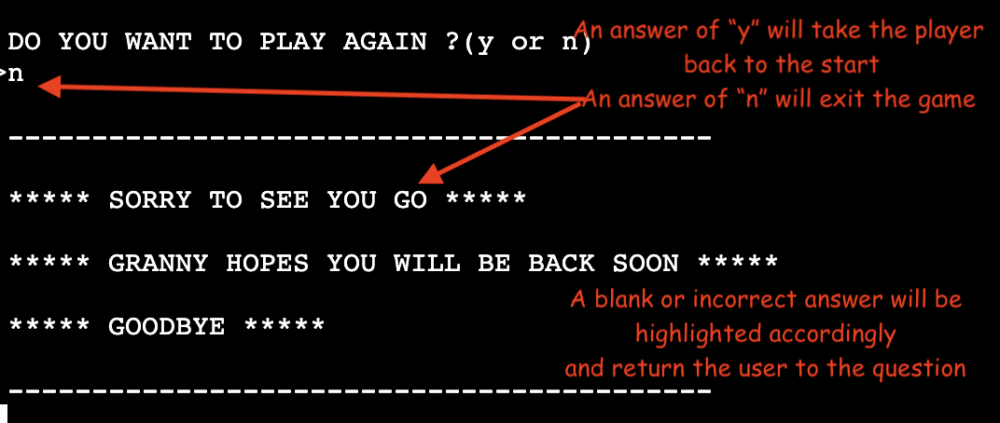
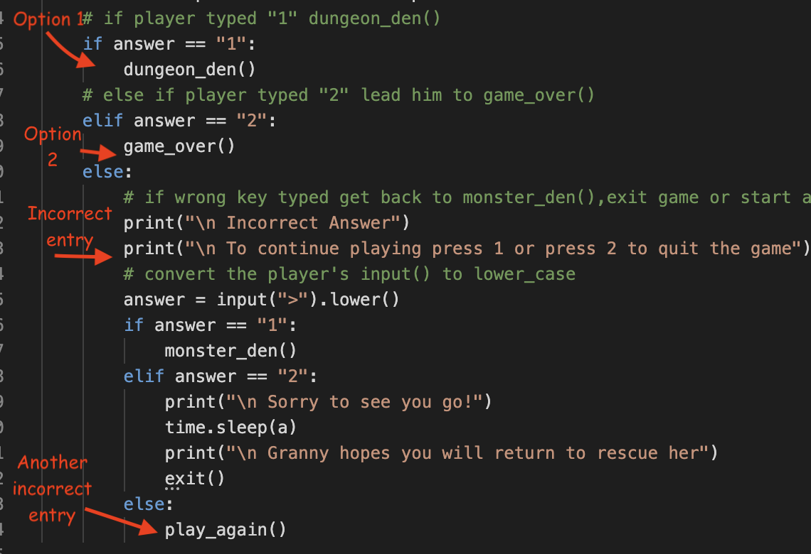
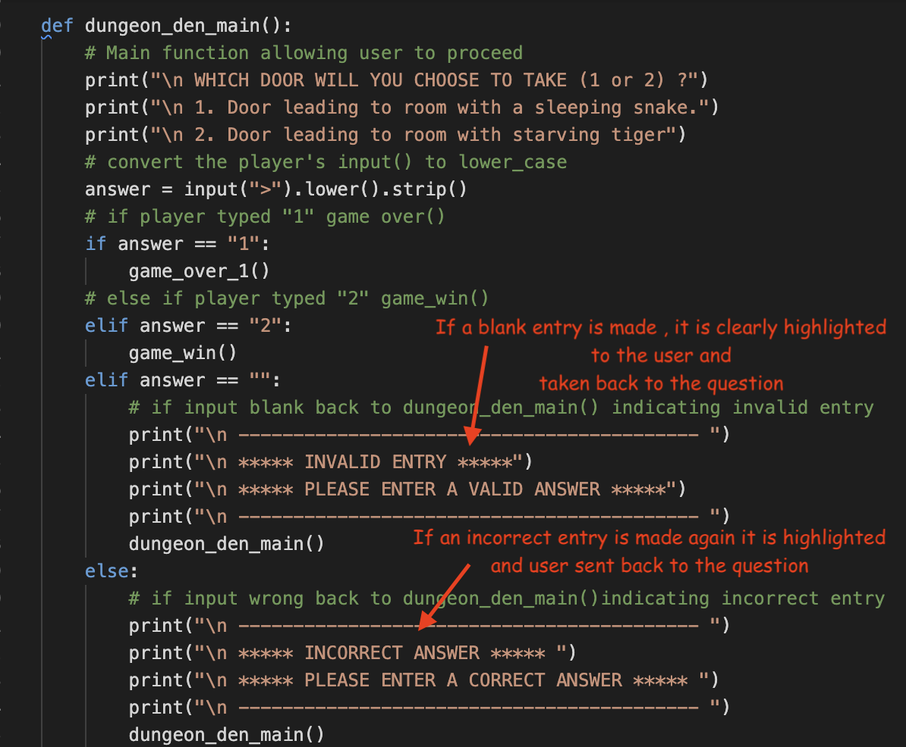
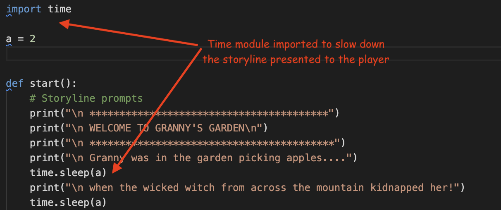

<h1 align="center">Granny's Garden</h1>

[View the live project here.](https://grannys-garden.herokuapp.com/)
<h2 align="center"></h2>

Granny's Garden is a Python terminal game that runs in a mock terminal on Heroku. Users need to try and save Granny, who the wicked witch has kidnapped.

### Origin of the game

Granny's Garden is a logic game based on the educational adventure game created for the British BBC Microcomputer, released in 1983. You can read more about it on [Wikipedia](https://en.wikipedia.org/wiki/Granny%27s_Garden). 

# How to play

There is an introduction storyline, which speaks of how the wicked witch kidnapped Granny from her garden.
 

The player may proceed further if they wish to rescue granny.  It takes the player through a myriad of paths through the game.
 

Eventually, the player will complete the game by either losing as the incorrect path was chosen or winning after following the correct route and rescuing granny.
 

At every stage, there are two routes. Typing a wrong or blank answer will return a response of an incorrect or invalid answer. After informing the player the answer is incorrect or invalid , it will return the player to the question being asked.

 

# Data Model
The flowchart created on 
[Lucid Charts](https://www.lucidchart.com/pages/) gives the logic of the game.

<h2 align="center"></h2>

# Features

- Introduction
    - The wicked witch has kidnapped granny.
    - The player is given the option to rescue granny.
    - If the play agrees, the game proceeds.
    - If the player does not wish to, the game will end.
    - Responses at each stage of the game (y /n or 1/2) can be typed in lower or upper case. 
    - If a player enters a blank response it will be flagged up with "INVALID ENTRY" and the player will returned to the same question.
    - If a player enters an incorrect response it will be flagged up with "INCORRECT ENTRY" and the player will returned to the same question.
    - Each function has been divided into two parts . 
        - The first part is the storyline.
        - The second part allows the user to take decisions.
    
   <h2 align="center"></h2>
   <h2 align="center"></h2>
   <h2 align="center"></h2>
   <h2 align="center"></h2>

- Crossroads
    - This is the first point of decision if the player proceeds to rescue granny
    - The player is given the option to turn left or right.
    - Left will take the player to the bear's den
    - Right will take the player to the monster's den
    - If a player enters a blank response it will be flagged up with "INVALID ENTRY".
    - If a player enters an incorrect response it will be flagged up with "INCORRECT ENTRY".
    - A blank or incorrect response after highlightling it to the player will return to the question to continue playing.
    <h2 align="center"></h2>
    <h2 align="center"></h2>

- Bear and Monster Den

    - At the next level, the player will need to proceed through either the Bear or Monster den.
    - Both den's will lead the player to either the witch's dungeon or lose the game.
    - Through both options if a player enters a blank response it will be flagged up with "INVALID ENTRY".
    - Through both options if a player enters an incorrect response it will be flagged up with "INCORRECT ENTRY".
    - A blank or incorrect response after highlightling it to the player will return to the question to continue playing.
<h2 align="center"></h2>
<h2 align="center"></h2>
<h2 align="center"></h2>
<h2 align="center"></h2>
<h2 align="center"></h2>
<h2 align="center"></h2>

- Dungeon Den

    - If the player is successful from the previous level, they will enter the dungeon den.
    - Here, the player will have two options leading to a win or loss.
    - If a player enters a blank response it will be flagged up with "INVALID ENTRY".
    - If a player enters an incorrect response it will be flagged up with "INCORRECT ENTRY".
    - A blank or incorrect response after highlightling it to the player will return to the question to continue playing.
<h2 align="center"></h2>
<h2 align="center"></h2>

- Choices

    - At all levels the player is presented with two choices.
    - If a player enters a blank response it will be flagged up with "INVALID ENTRY".
    - If a player enters an incorrect response it will be flagged up with "INCORRECT ENTRY".
    - A blank or incorrect response after highlightling it to the player will return to the question to continue playing.
<h2 align="center"></h2>
<h2 align="center"></h2>
    

- Conclusion 
    - The game concludes with the player choosing the correct path and winning by rescuing granny.
    - By choosing the wrong path , the player loses and the game is over.

<h2 align="center"></h2>
<h2 align="center"></h2>
<h2 align="center"></h2>
<h2 align="center"></h2>

- Play again

    - When the game concludes as a win or loss , the player is asked if they will play again.
    - An affirmative answer (y) will take them back to the start of the game.
    - A blank or incorrect response will be highlighted and the play returned to the question.
    - An answer of No (n) will tell the player that " Granny hopes to see them back soon. Goodbye" and then EXITS the game.
    
<h2 align="center"></h2>

<h2 align="center"></h2>

# Testing

I have manually tested this project by doing the following:

- Passed the code through PEP8 linter and confirmed there are no problems.
- Given invalid/ incorrect  options to ensure the function will check and highlight it to the player before returning to the question.
- Tested in my local terminal and Heroku terminal.
-  Tested by peers and my mentor.

# Bugs
### Solved Bugs

When I wrote the project, notable errors included:

- Unwanted white spaces.
- Incorrect indentation, resulting in the program not functioning correctly.
- Incorrect line spaces between functions.
- Within each function, the nested "if" statement within the "else" statement did not work properly as the structure was incorrect.
- It was found that if the player added an extra blank space before entering a correct option, it was considered incorrect. And the incorrect option loop was followed. It has been resolved by using 
.strip(). This allows the user to type in options of y/n or 1/2 even with a blank space before . The blank space is overridden and the system validates the answer to the appropriate response.
- .lower() has been used to allow the user to type the correct responses in upper or lower case and the system is able to validate the answer correctly.

   -  VALIDATION 
        - Another error which was found when entering a BLANK entry or an INCORRECT entry , the game simply looped in both cases to the beginning of the function without giving any reason to the user. Improper validation confuses the player who may not realise the mistake or blank entry made. Therefore this has been corrected.

 
<h2 align="center"></h2>

- This has been corrected by adding an error message which comes up when a BLANK ENTRY or INCORRECT ENTRY is made . The user's mistake is highlighted clearly and taken back to the question to continue playing.

<h2 align="center"></h2>

- Occasionally, the terminal in Heroku hangs while playing the game. It is perhaps a connectivity issue between git and the Heroku terminal. In such a case pressing "Run program" restarts and then functions properly. 

### Remaining Bugs
- No bugs remaining.

### Validator Testing
 - PEP8 

    - No errors have been returned from PEP8online.com.

    <h2 align="center"></h2>

# Creation and Deployment

The project has been created on gitpod and deployed to GitHub Pages. 

It was then deployed using a mock terminal for Heroku.

- Steps for deployment to Heroku Mock Terminal
    - Fork or clone this repository.
    - Create a new Heroku app.
    - Set the buildbacks to Python and NodeJS , in that order.
    - Link the Heroku app to the repository.
    - Click on deploy.

## Python Modules
The Python time module provides many ways of representing time in code, such as objects, numbers, and strings. It also provides functionality other than representing time, like waiting during code execution and measuring the efficiency of your code.

The time module comes with Python’s standard utility module, so there is no need to install it externally. We can simply import it using the import statement.

In Granny's garden the time module has been used at various points to allow the storylines to be presented to reader with a 2  sec delay.

 <h2 align="center"></h2>

# Credits
### Code & Creation

-   [The Coding pie](https://thecodingpie.com/post/make-your-own-text-based-adventure-game-in-python3) 

-   [Lucid Charts](https://www.lucidchart.com/pages/) 

### Inspiration

-  [Granny's Garden](https://en.wikipedia.org/wiki/Granny%27s_Garden)

### Content & Deployment

- All content for the game is written by the developer.
- Language and Grammar for the Readme.md corrected using [Grammarly](https://www.grammarly.com).
- Code Institute for the deployment terminal.

### Media

- Mock Terminal Screen Shot was sourced from [AmIresponsive](http://ami.responsivedesign.is/) and desktop screenshots.

### Acknowledgement(s)

-  I would like to thank my mentor Adegbenga Adeye. His guidance in giving constructive feedback through all stages of site design and development has been most valuable.